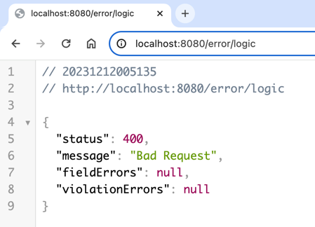
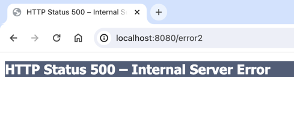

# Global RestControllerAdvice Exception


### Custom status, error message and fields like this



### Spring default message (No custom)



---
## 1. @RestControllerAdvice 
- ExceptionAdvice.class 
```java
@Slf4j
@RestControllerAdvice
public class ExceptionAdvice {
    
    // 400 error
    @ExceptionHandler
    @ResponseStatus(HttpStatus.BAD_REQUEST)
    public ErrorResponse handleMethodArgumentNotValidException(
        MethodArgumentNotValidException e) {
        log.warn("#MethodArgumentNotValidException", e)
        return ErrorResponse.of(e.getBindingResult());
    }
    
    // 500 error
    @ExceptionHandler
    @ResponseStatus(HttpStatus.INTERNAL_SERVER_ERROR)
    public ErrorResponse handleException(HttpServletRequest req,Exception e) {
        log.error("# handle Exception", e);
        return ErrorResponse.of(HttpStatus.INTERNAL_SERVER_ERROR);
    }
    
    // server custom logic error
    @ExceptionHandler
    public ResponseEntity<ErrorResponse> handleLogicException(CustomException e) {
        final ErrorResponse response = ErrorResponse.of(e.getExceptionCode());
        return new ResponseEntity<>(response, HttpStatus.valueOf(e.getExceptionCode()
            .getStatus()));
    }
    // other codes...
}


```
- Handle exception handling for all @RestControllers.
- If a MethodArgumentNotValidException is thrown, Returns a customized ErrorResponse.
